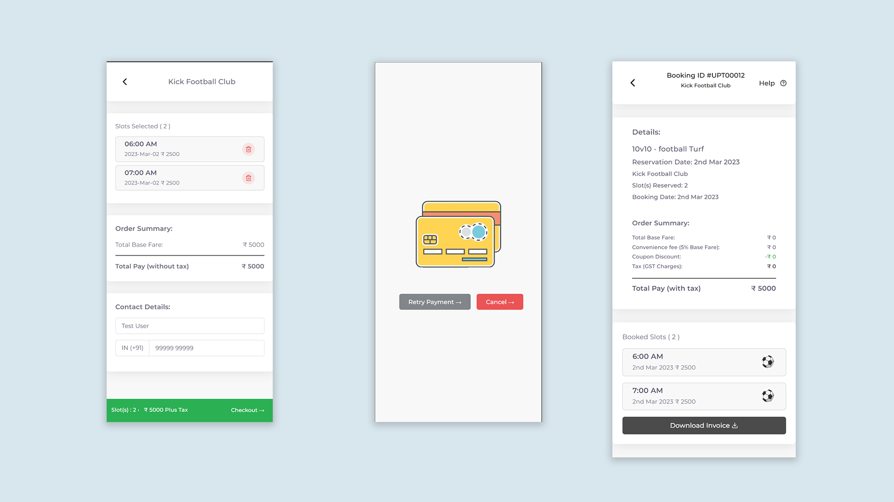

# Upturf

Upturf is a comprehensive turf booking platform designed to streamline the booking experience for sports enthusiasts, turf owners, and administrators. The platform includes dedicated interfaces for users, vendors (turf owners), and admins, providing tailored functionalities for each group. Upturf is built with modern web technologies to ensure seamless performance and a mobile-friendly experience.

## Overview

Upturf is built as a Progressive Web App (PWA) to offer users a smooth and app-like experience across devices. It supports secure login, booking, and split payment options for flexible transaction handling. Vendors can manage their turf profiles, booking schedules, and receive insightful analytics, while admins have control over user management, content moderation, and platform analytics.

## Features

### Common Authentication

A single authentication system redirects users to their respective platform (user, vendor, or admin) based on their credentials. Each role has unique access to backend APIs tailored to their requirements.

### User Platform

- **Progressive Web Application (PWA)**: Access Upturf seamlessly from any device with native-like experience.
- **Split Payments**: Users can split payments with others, making booking simpler and more flexible.
- **Turf Discovery**: Browse top turfs, filter by sports categories, select dates, and view detailed turf info including address, location, and contact.
- **Slot Booking**: Easy-to-navigate booking page with real-time slot availability.
- **Checkout & Payment**: Secure checkout with payment confirmation.

### Vendor Platform

- **Profile Management**: Vendors can set up and manage their profiles.
- **Dashboard**: Vendors have a centralized view of their bookings, revenue stats, and turf activity.
- **Turf Management**: Vendors can list, edit, and manage their turf offerings, including availability and sports categories.

### Admin Platform

- **User and Vendor Management**: Admins can monitor, add, or remove users and vendors.
- **Content Moderation**: Oversee content to maintain the quality and relevance of listings.
- **Platform Analytics**: Gain insights into user activity, booking trends, and overall platform performance.

## Technical Stack

Upturf is built with a powerful stack to ensure robust performance, high scalability, and real-time data management.

- **Frontend**: Developed using [Vue.js](https://vuejs.org/), providing a responsive, interactive user experience and facilitating the Progressive Web App (PWA) capabilities.
- **Backend**: Powered by [Node.js](https://nodejs.org/) with [Express](https://expressjs.com/) for routing and API handling.
- **Real-Time Data & GraphQL**: [Hasura](https://hasura.io/) for instant GraphQL APIs on top of PostgreSQL, enabling efficient data syncing across user, vendor, and admin interfaces.
- **Google Cloud Platform (GCP)**: Used for hosting and cloud storage solutions, ensuring scalable, reliable, and secure data handling.

## Screenshots

### Vendor Platform

1. **Login Page**  
   

2. **Profile Creation**  
   

3. **Dashboard**  
   

4. **Turf Management**  
   

### User Platform

1. **Home Page**  
   

2. **Turf Details**  
   

3. **Checkout Page**  
   

## Installation

To run Upturf locally, follow these steps:

1. **Clone the Repository**:
   ```bash
   git clone https://github.com/your-username/upturf.git
